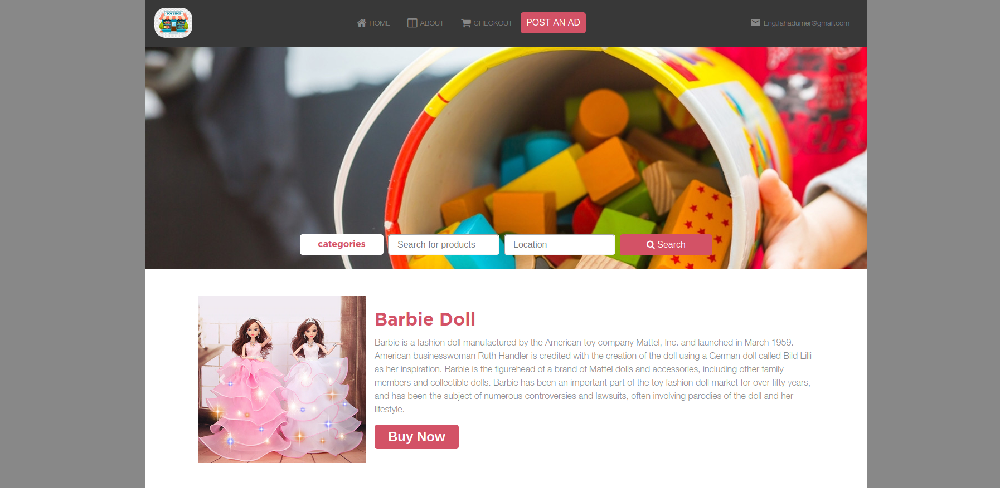
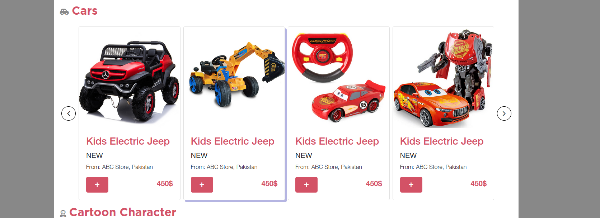
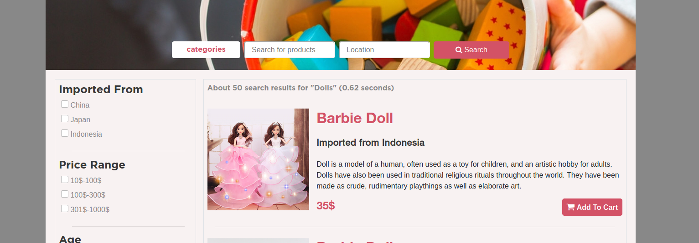
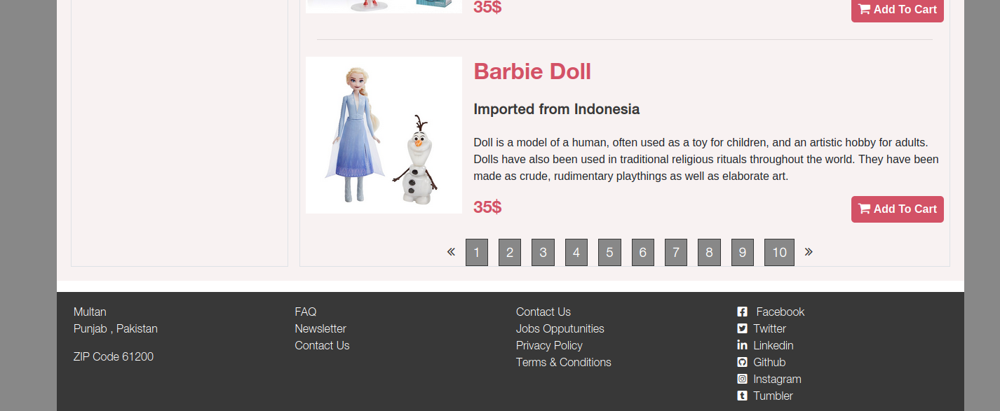
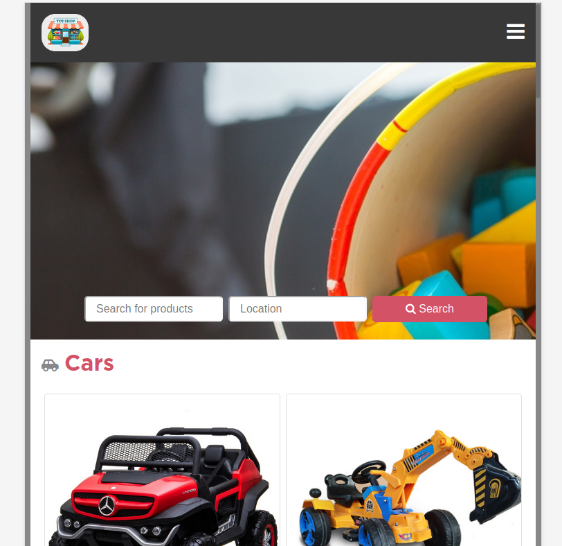
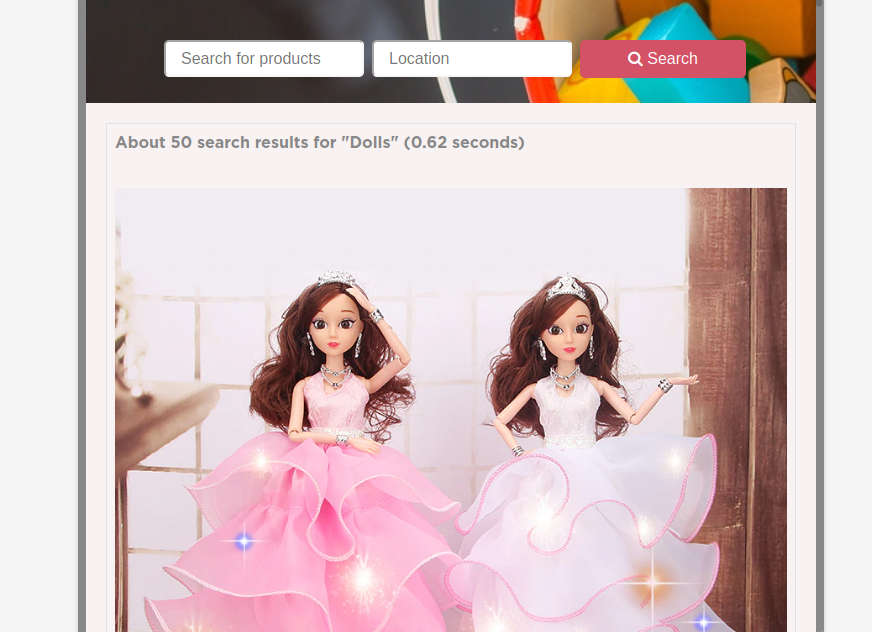
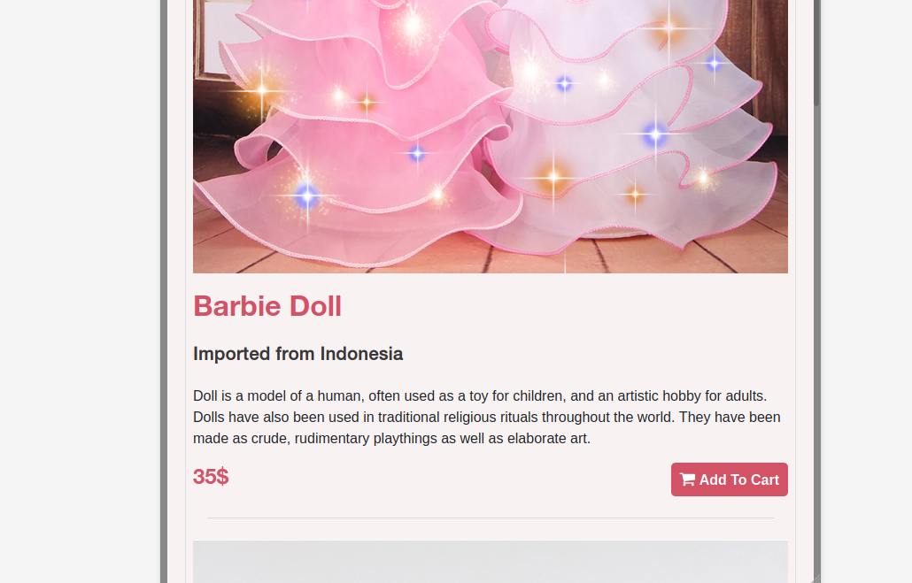

# Project Name

> Capstone Project. This is a project based on a Glance design . for this project ive to create an online shop for the products of our own choice. so that I've created a website for Toys online shop.
 In this project I used all the previous knowledge like bootstrap, flex box, grid, float, position. ive also used the bakground image for search section. This website is responsive for 2 devices not for extra small devices.

Additional description about the project and its features.

## Built With

- HTML
- CSS
- BOOTSTRAP

## Live Demo

[Live Demo Link]()

## Getting Started

**Need web browser.**

To get a local copy up and running follow these simple example steps.

### Download Repository (git@github.com:MFahadUmer/Capstone-Project.git)
### cd <folder>
### run the index.html file

## Authors

👤 **Muhammad Fahad Umer**

- Github: [@MFahadUmer](https://github.com/MFahadUmer)
- Twitter: [@engfahadumer](https://twitter.com/engfahadumer)
- Linkedin: [linkedin](https://www.linkedin.com/in/engineer-muhammad-fahad-e-umer-08813055/)

## 🤝 Contributing

Contributions, issues and feature requests are welcome!

Feel free to check the [issues page](git@github.com:MFahadUmer/Capstone-Project.git).

## Show your support

Give a ⭐️ if you like this project!
## Acknowledgments

- Hat tip to anyone whose code was used
- Inspiration
- etc
