# Project Name

> Capstone Project. This is a project based on a Glance design . For this project ive to create an online shop for the products of our own choice. So, I've created a website for Toys online shop. In this project I used all the previous knowledge like bootstrap, flex box, grid, float, position. ive also used the bakground image for search section. This website is responsive.

# Mobile Devices

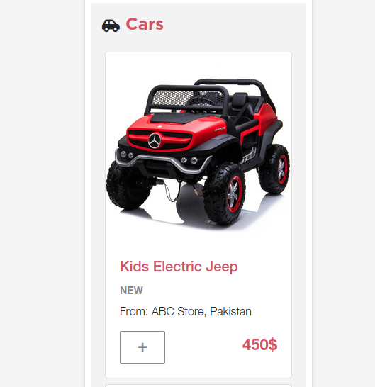
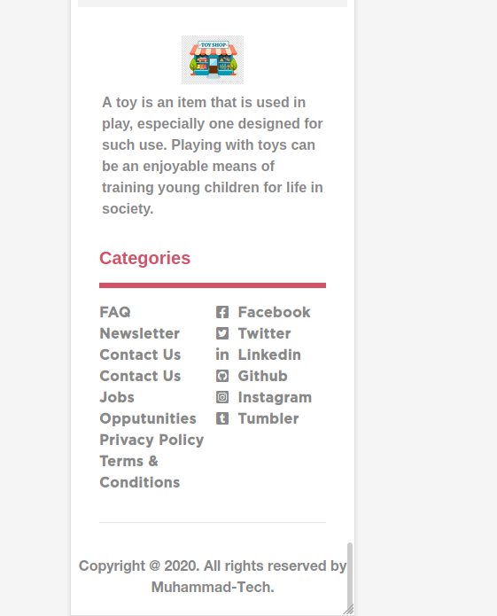
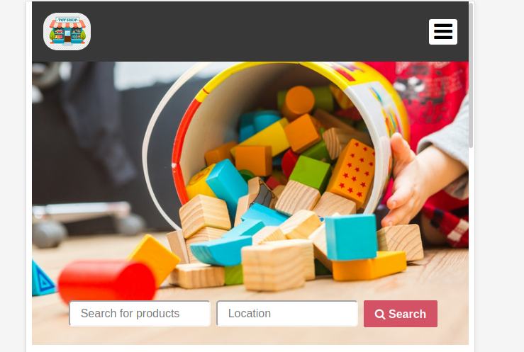
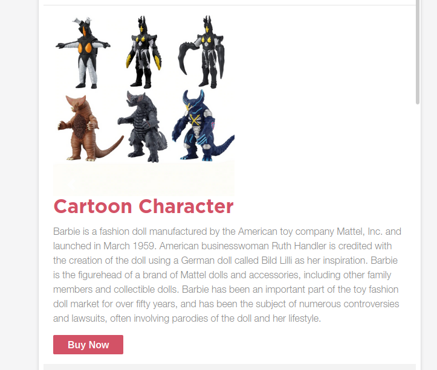
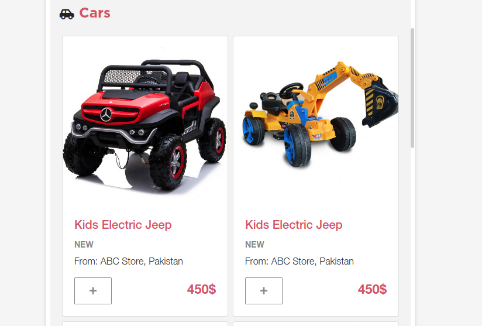
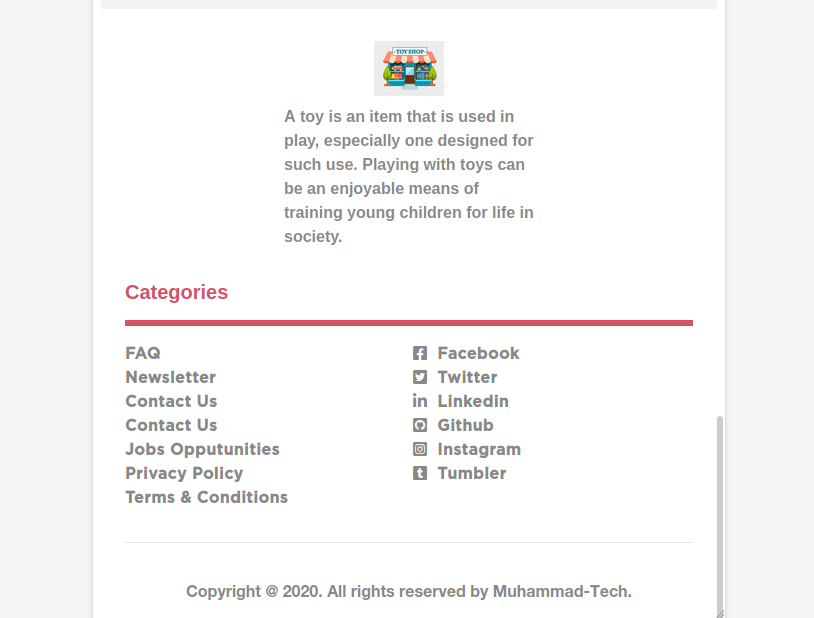

# Medium Devices

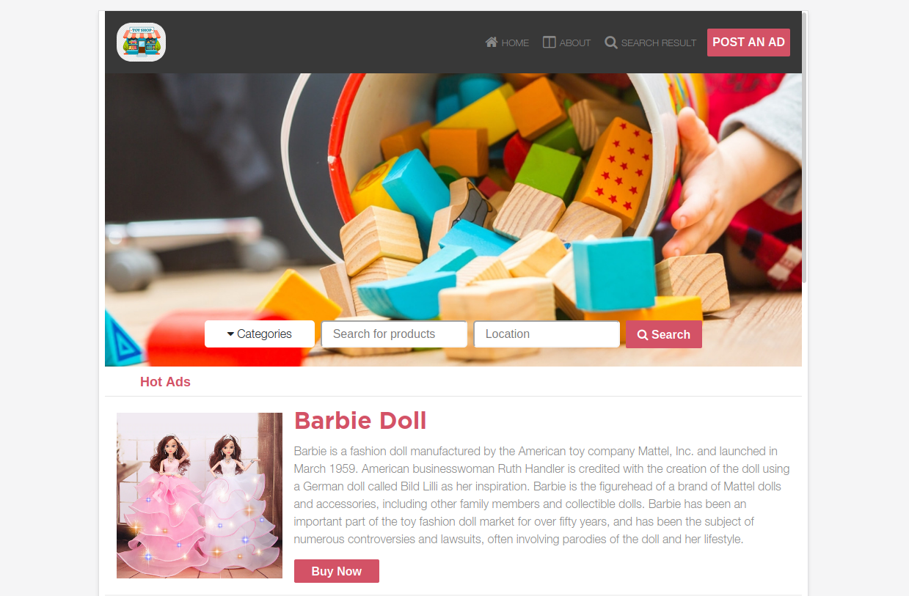
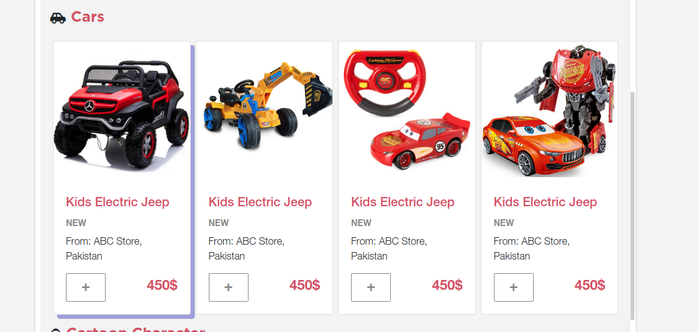

# Large Devices
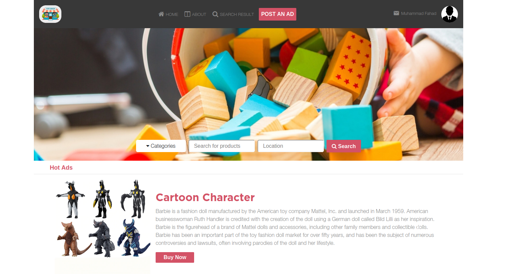
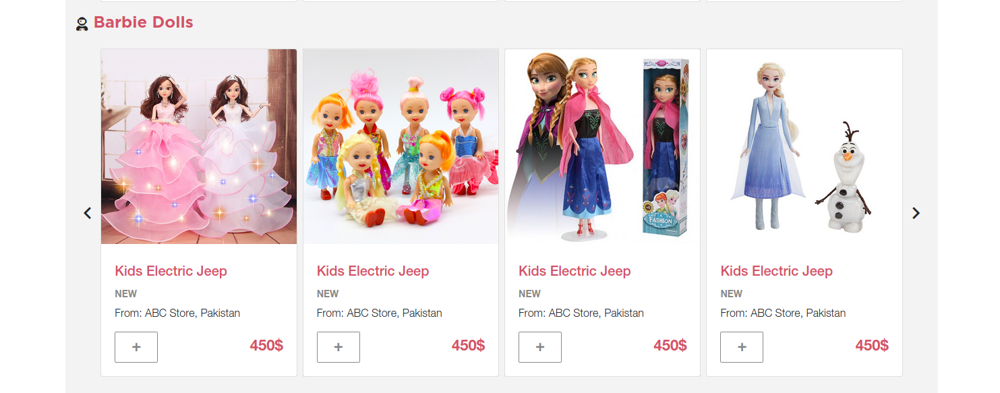
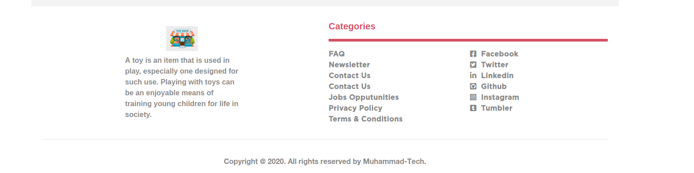
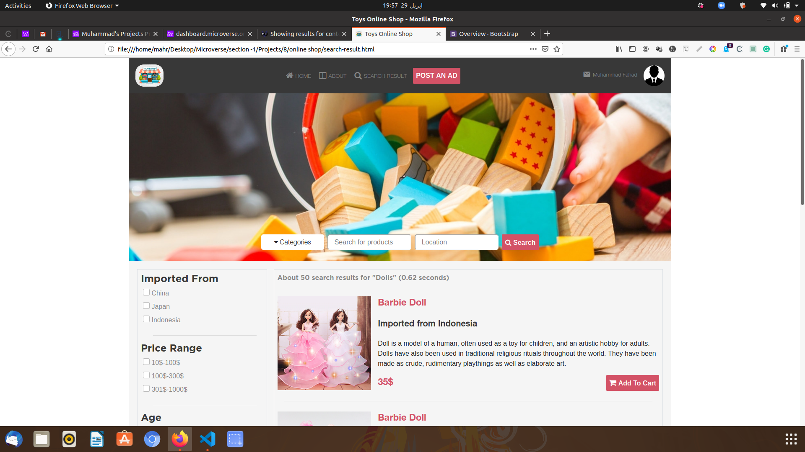
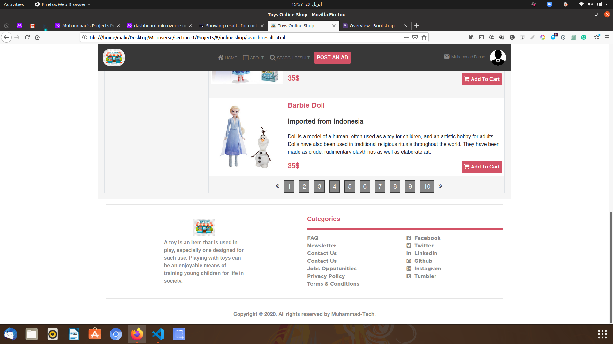

Additional description about the project and its features.
- A sticky navbar
- Search box with background image
- Products Section
- Search Results Page
- Filter Section
- Footer

## Built With

- HTML
- CSS
- BOOTSTRAP
- Flexbox
- Grid
- Position
- Media Queries

## Live Demo

[Live Demo Link](https://rawcdn.githack.com/MFahadUmer/Capstone-Project/6f4942fe713bb580605baa3422f723bb6c825f0b/index.html)

## Getting Started

**Need web browser.**

To get a local copy up and running follow these simple example steps.

### [Download Repository] (git@github.com:MFahadUmer/Capstone-Project.git)
### cd online-shop
### run the index.html file

## Authors

👤 **Muhammad Fahad Umer**

- Github: [@MFahadUmer](https://github.com/MFahadUmer)
- Twitter: [@engfahadumer](https://twitter.com/engfahadumer)
- Linkedin: [linkedin](https://www.linkedin.com/in/engineer-muhammad-fahad-e-umer-08813055/)

## 🤝 Contributing

Contributions, issues and feature requests are welcome!

Feel free to check the [issues page](git@github.com:MFahadUmer/Capstone-Project.git).

## Show your support

Give a ⭐️ if you like this project!

## Acknowledgments

- Hat tip to anyone whose code was used
- Special thanks to [Microverse] (microverse.org) who help me to complete this design and also to [Muhammad Awad] (https://www.behance.net) whose design i've used.
- etc
